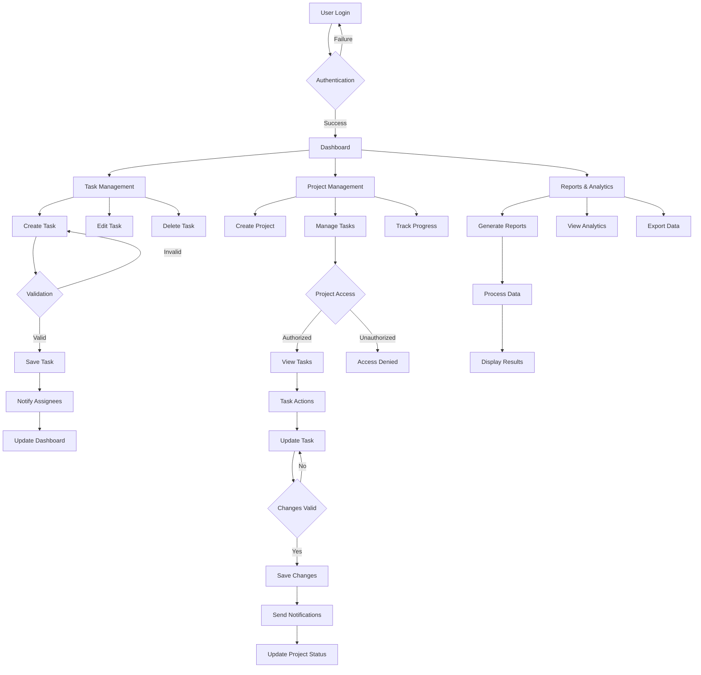
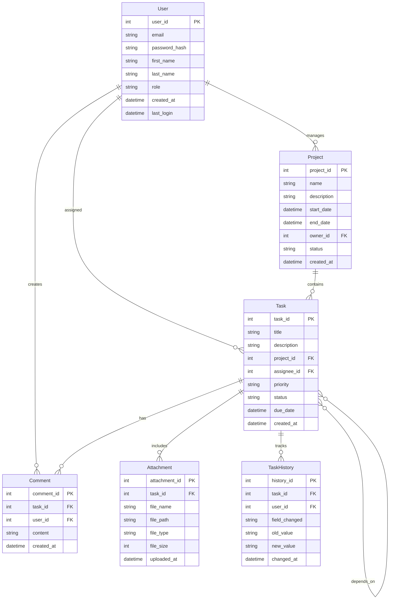
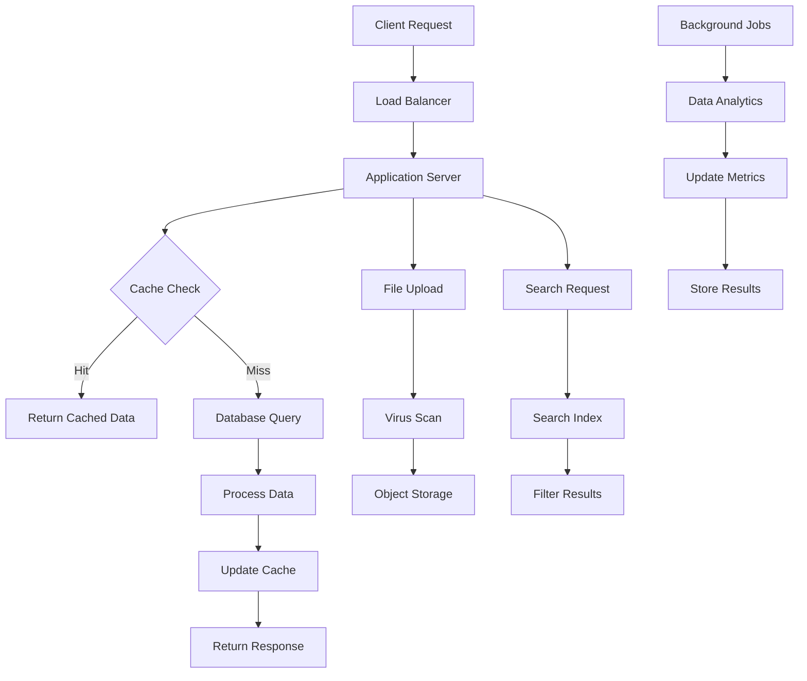
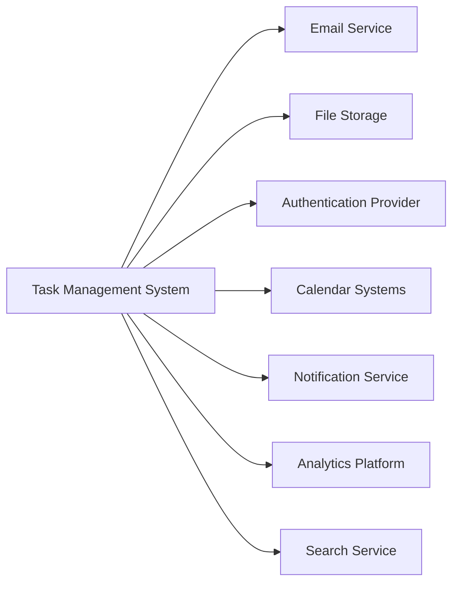

# Product Requirements Document (PRD)

# 1. INTRODUCTION

## 1.1 Purpose
This Software Requirements Specification (SRS) document provides a comprehensive description of the Task Management System. It details the functional and non-functional requirements for the development team, project stakeholders, and quality assurance team. The document serves as the primary reference for technical and non-technical audiences to understand the system's intended behavior, constraints, and performance expectations.

## 1.2 Scope
The Task Management System is a web-based application designed to streamline task organization and team collaboration. The system encompasses:

- Task Creation and Management
  - Create, edit, and delete tasks
  - Assign due dates, priorities, and team members
  - Track task status and progress
  - Attach files and documents

- Project Organization
  - Categorize tasks into projects
  - Set project hierarchies and dependencies
  - Monitor project timelines and milestones

- Team Collaboration
  - Real-time updates and notifications
  - Comment threads on tasks
  - File sharing capabilities
  - Role-based access control

- Reporting and Analytics
  - Dashboard for task status overview
  - Progress tracking metrics
  - Productivity analysis tools
  - Custom report generation

- User Management
  - User roles and permissions
  - Team management
  - Access control and security

The system aims to improve team productivity, enhance communication, and provide clear visibility into project progress while maintaining data security and user privacy.

# 2. PRODUCT DESCRIPTION

## 2.1 Product Perspective
The Task Management System operates as a standalone web application while integrating with existing enterprise systems and services:

- Browser-based interface accessible across desktop and mobile devices
- Cloud-hosted solution with distributed architecture
- Integration capabilities with:
  - Email systems for notifications
  - Calendar applications for deadline synchronization
  - Cloud storage services for file attachments
  - Single Sign-On (SSO) systems for enterprise authentication
  - Third-party messaging platforms for notifications

## 2.2 Product Functions
The system provides the following core functions:

| Function Category | Key Features |
|------------------|--------------|
| Task Management | - Task creation and modification - Priority and status assignment - Due date management - File attachments - Task dependencies tracking |
| Project Organization | - Project hierarchy creation - Task grouping and categorization - Timeline visualization - Milestone tracking |
| Collaboration | - Real-time updates - Comment threads - @mentions and notifications - Shared workspaces |
| Reporting | - Customizable dashboards - Progress metrics - Performance analytics - Export capabilities |
| Administration | - User management - Permission controls - System configuration - Audit logging |

## 2.3 User Characteristics

| User Type | Characteristics | Technical Expertise |
|-----------|----------------|-------------------|
| Administrators | - System configuration management - User access control - Organization-wide settings | High technical proficiency required |
| Project Managers | - Project planning and oversight - Resource allocation - Performance monitoring | Moderate to high technical proficiency |
| Team Members | - Task execution - Progress updates - Collaboration | Basic computer literacy |
| Stakeholders | - Progress monitoring - Report viewing - High-level oversight | Minimal technical requirements |

## 2.4 Constraints
- Technical Constraints
  - Must support modern web browsers (Chrome, Firefox, Safari, Edge)
  - Maximum file attachment size of 25MB
  - Response time under 2 seconds for standard operations
  - 99.9% system availability

- Security Constraints
  - GDPR and CCPA compliance requirements
  - Data encryption at rest and in transit
  - Regular security audits and penetration testing
  - Multi-factor authentication support

- Business Constraints
  - Must integrate with existing enterprise systems
  - Scalable to support up to 10,000 concurrent users
  - Mobile-responsive design requirement
  - Accessible design following WCAG 2.1 guidelines

## 2.5 Assumptions and Dependencies
Assumptions:
- Users have stable internet connectivity
- Modern web browser availability
- Basic understanding of task management concepts
- Access to corporate email for notifications
- Sufficient storage capacity for file attachments

Dependencies:
- Cloud infrastructure availability
- Third-party integration services uptime
- Browser compatibility with modern web standards
- Email service providers for notifications
- Database management system reliability
- Content delivery network performance
- SSL certificate validity

# 3. PROCESS FLOWCHART

# 4. FUNCTIONAL REQUIREMENTS

## 4.1 User Authentication and Authorization

### ID: FR-1
### Description
User authentication and authorization system managing access control and security.
### Priority: High
### Requirements

| ID | Requirement | Description |
|----|-------------|-------------|
| FR-1.1 | User Registration | System shall allow new users to register with email, password, and profile information |
| FR-1.2 | Authentication | Support email/password and SSO authentication methods |
| FR-1.3 | Password Management | Enable password reset, change, and enforce security policies |
| FR-1.4 | Role Management | Support role assignment (Admin, Project Manager, Team Member, Stakeholder) |
| FR-1.5 | Permission Control | Granular access control for features based on user roles |

## 4.2 Task Management

### ID: FR-2
### Description
Core task creation and management functionality.
### Priority: High
### Requirements

| ID | Requirement | Description |
|----|-------------|-------------|
| FR-2.1 | Task Creation | Users can create tasks with title, description, due date, priority, and assignees |
| FR-2.2 | Task Editing | Allow modification of task details and properties |
| FR-2.3 | Task Status | Support status transitions (To Do, In Progress, Done, etc.) |
| FR-2.4 | File Attachments | Enable file uploads up to 25MB per task |
| FR-2.5 | Task Dependencies | Allow linking related tasks and setting dependencies |

## 4.3 Project Management

### ID: FR-3
### Description
Project organization and hierarchy management.
### Priority: High
### Requirements

| ID | Requirement | Description |
|----|-------------|-------------|
| FR-3.1 | Project Creation | Enable creation of projects with metadata and team assignments |
| FR-3.2 | Task Grouping | Allow grouping tasks within projects and sub-projects |
| FR-3.3 | Timeline Management | Support project timeline visualization and milestone tracking |
| FR-3.4 | Resource Allocation | Enable assignment and management of team resources |
| FR-3.5 | Project Templates | Allow saving and reusing project templates |

## 4.4 Collaboration Features

### ID: FR-4
### Description
Team collaboration and communication tools.
### Priority: Medium
### Requirements

| ID | Requirement | Description |
|----|-------------|-------------|
| FR-4.1 | Comments | Enable commenting on tasks and projects |
| FR-4.2 | Notifications | Real-time notifications for updates and mentions |
| FR-4.3 | File Sharing | Support file sharing and version control |
| FR-4.4 | Activity Feed | Display real-time activity updates |
| FR-4.5 | Team Chat | Integrated team messaging functionality |

## 4.5 Reporting and Analytics

### ID: FR-5
### Description
Data visualization and reporting capabilities.
### Priority: Medium
### Requirements

| ID | Requirement | Description |
|----|-------------|-------------|
| FR-5.1 | Dashboard | Customizable dashboard with key metrics |
| FR-5.2 | Progress Tracking | Visual representation of project and task progress |
| FR-5.3 | Performance Metrics | Analytics for team and individual performance |
| FR-5.4 | Custom Reports | Generate customized reports with filtered data |
| FR-5.5 | Data Export | Export capabilities in multiple formats (CSV, PDF, Excel) |

## 4.6 System Integration

### ID: FR-6
### Description
Integration capabilities with external systems.
### Priority: Low
### Requirements

| ID | Requirement | Description |
|----|-------------|-------------|
| FR-6.1 | Email Integration | Sync with email systems for notifications |
| FR-6.2 | Calendar Sync | Integrate with calendar applications |
| FR-6.3 | Storage Integration | Connect with cloud storage services |
| FR-6.4 | SSO Integration | Support enterprise SSO systems |
| FR-6.5 | API Access | Provide REST API for external integrations |

# 5. NON-FUNCTIONAL REQUIREMENTS

## 5.1 Performance Requirements

| ID | Requirement | Description | Target Metric |
|----|-------------|-------------|---------------|
| NFR-1.1 | Response Time | Maximum time for standard operations | < 2 seconds |
| NFR-1.2 | Page Load Time | Time to load and render main pages | < 3 seconds |
| NFR-1.3 | Concurrent Users | System capacity for simultaneous users | 10,000 users |
| NFR-1.4 | Database Query Time | Maximum time for complex queries | < 1 second |
| NFR-1.5 | API Response Time | Maximum time for API endpoints | < 500ms |
| NFR-1.6 | File Upload Speed | Minimum upload speed for attachments | 5MB/second |

## 5.2 Safety Requirements

| ID | Requirement | Description |
|----|-------------|-------------|
| NFR-2.1 | Data Backup | Automated daily backups with 30-day retention |
| NFR-2.2 | Disaster Recovery | Recovery Point Objective (RPO) of 1 hour |
| NFR-2.3 | System Recovery | Recovery Time Objective (RTO) of 4 hours |
| NFR-2.4 | Data Integrity | Automatic validation and consistency checks |
| NFR-2.5 | Fault Tolerance | Graceful degradation of non-critical features |

## 5.3 Security Requirements

| ID | Requirement | Description |
|----|-------------|-------------|
| NFR-3.1 | Authentication | Multi-factor authentication support |
| NFR-3.2 | Data Encryption | AES-256 encryption for data at rest |
| NFR-3.3 | Transport Security | TLS 1.3 for all data in transit |
| NFR-3.4 | Access Control | Role-based access control (RBAC) |
| NFR-3.5 | Session Management | Automatic session timeout after 30 minutes |
| NFR-3.6 | Audit Logging | Comprehensive logging of all security events |
| NFR-3.7 | Vulnerability Scanning | Monthly security scans and penetration testing |

## 5.4 Quality Requirements

### 5.4.1 Availability
- System uptime of 99.9% excluding planned maintenance
- Maximum planned downtime of 4 hours per month
- Automated health monitoring and alerting

### 5.4.2 Maintainability
- Modular architecture for easy component updates
- Comprehensive API documentation
- Automated deployment pipeline
- Code coverage minimum of 80%

### 5.4.3 Usability
- WCAG 2.1 Level AA compliance
- Maximum of 3 clicks to reach any feature
- Consistent UI/UX across all platforms
- Support for multiple languages
- Mobile-responsive design

### 5.4.4 Scalability
- Horizontal scaling capability
- Auto-scaling based on load metrics
- Database partitioning support
- Content Delivery Network integration

### 5.4.5 Reliability
- Mean Time Between Failures (MTBF) > 720 hours
- Mean Time To Repair (MTTR) < 2 hours
- Error rate < 0.1% for all transactions
- Automated failover capabilities

## 5.5 Compliance Requirements

| ID | Requirement | Description |
|----|-------------|-------------|
| NFR-5.1 | Data Protection | GDPR and CCPA compliance |
| NFR-5.2 | Accessibility | WCAG 2.1 Level AA standards |
| NFR-5.3 | Security Standards | SOC 2 Type II compliance |
| NFR-5.4 | Industry Standards | ISO 27001 certification |
| NFR-5.5 | Data Retention | Compliance with local data retention laws |
| NFR-5.6 | Audit Requirements | Support for external security audits |
| NFR-5.7 | Privacy Policy | Transparent data handling procedures |

# 6. DATA REQUIREMENTS

## 6.1 Data Models

## 6.2 Data Storage

### 6.2.1 Storage Requirements
- Primary Database: PostgreSQL for structured data
- File Storage: Object storage system for attachments
- Cache Layer: Redis for session management and real-time data
- Search Index: Elasticsearch for full-text search capabilities

### 6.2.2 Data Retention
- Active task data: Indefinite retention
- Completed tasks: 3 years retention
- Audit logs: 5 years retention
- System logs: 90 days retention
- Deleted items: 30 days soft delete
- File attachments: Linked to task retention period

### 6.2.3 Backup and Recovery
- Daily incremental backups
- Weekly full backups
- Point-in-time recovery capability
- Cross-region backup replication
- 30-day backup retention period
- Maximum 1-hour recovery time objective
- Maximum 15-minute recovery point objective

### 6.2.4 Data Redundancy
- Multi-AZ database deployment
- Real-time database replication
- Geographic redundancy for critical data
- File storage with 99.999999999% durability
- Hot standby database instances

## 6.3 Data Processing

### 6.3.1 Data Flow

### 6.3.2 Data Security
- Encryption at rest using AES-256
- TLS 1.3 for data in transit
- Database-level encryption
- Column-level encryption for sensitive data
- Key rotation every 90 days
- Secure file storage with server-side encryption
- Data masking for non-production environments

### 6.3.3 Data Processing Requirements
- Real-time task updates and notifications
- Asynchronous processing for heavy operations
- Batch processing for reports and analytics
- Rate limiting for API requests
- Request queue management
- Data validation and sanitization
- Automatic data archival process

### 6.3.4 Data Integration
- REST API for external system integration
- Webhook support for real-time updates
- Bulk import/export capabilities
- ETL processes for reporting
- Third-party system connectors
- Data transformation services

# 7. EXTERNAL INTERFACES

## 7.1 User Interfaces

### 7.1.1 General Requirements
- Responsive web design supporting viewport sizes from 320px to 4K
- Material Design 3.0 design system implementation
- Dark and light theme support
- Minimum touch target size of 44x44 pixels
- Maximum content width of 1440px
- Loading state indicators for operations >500ms

### 7.1.2 Key Interface Components

| Component | Requirements |
|-----------|--------------|
| Navigation | - Persistent top navigation bar - Collapsible side menu - Breadcrumb navigation - Quick action toolbar |
| Dashboard | - Customizable widget layout - Drag-and-drop interface - Real-time updates - Data visualization components |
| Task Views | - List/Board/Calendar views - Inline editing capabilities - Filtering and sorting controls - Batch action support |
| Forms | - Progressive disclosure - Real-time validation - Autosave functionality - Multi-step wizards for complex operations |

### 7.1.3 Accessibility Requirements
- WCAG 2.1 Level AA compliance
- Screen reader compatibility
- Keyboard navigation support
- Color contrast ratio minimum 4.5:1
- Focus indicators for interactive elements

## 7.2 Hardware Interfaces

### 7.2.1 Client Devices
- Minimum screen resolution: 320x568 pixels
- Input devices: Touch screen, mouse, keyboard
- Camera access for document scanning
- Local storage requirements: 100MB minimum
- Hardware acceleration support for animations

### 7.2.2 Server Infrastructure
- Load balancer interface requirements
- Storage system connectivity
- Network interface requirements: 10Gbps minimum
- Backup system interfaces
- Monitoring system integration points

## 7.3 Software Interfaces

### 7.3.1 Database Interfaces
- PostgreSQL 14+ with PostGIS extensions
- Connection pooling via PgBouncer
- Read replicas interface
- Backup system integration

### 7.3.2 External Service Interfaces

| Service Type | Interface Requirements |
|--------------|------------------------|
| Email Service | - SMTP/REST API support - Template rendering system - Attachment handling - Delivery status tracking |
| File Storage | - S3-compatible API - Multi-part upload support - CDN integration - Version control capability |
| Authentication | - OAuth 2.0/OpenID Connect - SAML 2.0 support - JWT token handling - MFA integration |
| Calendar | - CalDAV protocol support - iCal format compatibility - Two-way sync capability |

### 7.3.3 Integration Points

## 7.4 Communication Interfaces

### 7.4.1 Network Protocols
- HTTPS/TLS 1.3 for all external communications
- WebSocket for real-time updates
- HTTP/2 for API communications
- SMTP for email notifications
- DNS for service discovery

### 7.4.2 API Specifications

| API Type | Specifications |
|----------|----------------|
| REST API | - OpenAPI 3.0 specification - JSON/HAL format - Rate limiting headers - Pagination support - CORS configuration |
| WebSocket | - Socket.io protocol - Binary message support - Heartbeat mechanism - Automatic reconnection |
| Webhooks | - HTTPS endpoints - JSON payload format - Retry mechanism - Signature verification |

### 7.4.3 Data Exchange Formats
- JSON for API responses
- MessagePack for binary data
- CSV for data exports
- iCalendar for calendar data
- XML for legacy system integration
- Protocol Buffers for high-performance interfaces

# 8. APPENDICES

## 8.1 GLOSSARY

| Term | Definition |
|------|------------|
| Assignee | User designated as responsible for completing a task |
| Dashboard | Customizable interface showing key metrics and task information |
| Dependency | Relationship between tasks where one must be completed before another can begin |
| Milestone | Significant point or event in a project's timeline |
| Role-Based Access Control | Security approach restricting system access based on user roles |
| Sprint | Fixed time period for completing a set of tasks |
| Webhook | Automated message sent from the system to external applications when events occur |
| Workspace | Dedicated area within the system for a team or project |

## 8.2 ACRONYMS

| Acronym | Definition |
|---------|------------|
| API | Application Programming Interface |
| CCPA | California Consumer Privacy Act |
| CDN | Content Delivery Network |
| CORS | Cross-Origin Resource Sharing |
| GDPR | General Data Protection Regulation |
| JWT | JSON Web Token |
| MFA | Multi-Factor Authentication |
| MTBF | Mean Time Between Failures |
| MTTR | Mean Time To Repair |
| RBAC | Role-Based Access Control |
| REST | Representational State Transfer |
| RPO | Recovery Point Objective |
| RTO | Recovery Time Objective |
| SAML | Security Assertion Markup Language |
| SLA | Service Level Agreement |
| SMTP | Simple Mail Transfer Protocol |
| SOC | System and Organization Controls |
| SSO | Single Sign-On |
| TLS | Transport Layer Security |
| WCAG | Web Content Accessibility Guidelines |

## 8.3 ADDITIONAL REFERENCES

| Reference | Description | URL |
|-----------|-------------|-----|
| Material Design 3.0 | Design system guidelines | https://m3.material.io/ |
| WCAG 2.1 | Web accessibility guidelines | https://www.w3.org/WAI/WCAG21/quickref/ |
| PostgreSQL Documentation | Database reference | https://www.postgresql.org/docs/14/index.html |
| OAuth 2.0 Specification | Authentication protocol | https://oauth.net/2/ |
| OpenAPI 3.0 | API documentation standard | https://spec.openapis.org/oas/v3.0.3 |
| Socket.io Documentation | WebSocket implementation | https://socket.io/docs/v4/ |
| Redis Documentation | Cache system reference | https://redis.io/documentation |
| Elasticsearch Guide | Search engine documentation | https://www.elastic.co/guide/index.html |