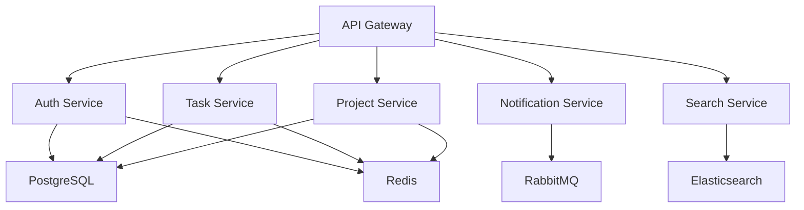

# Task Management System - Backend Services


Enterprise-grade task management system backend services built with microservices architecture.

## Table of Contents

- [Overview](#overview)
- [Architecture](#architecture)
- [Prerequisites](#prerequisites)
- [Getting Started](#getting-started)
- [Development](#development)
- [Deployment](#deployment)
- [Security](#security)
- [Performance](#performance)
- [Contributing](#contributing)

## Overview

The Task Management System backend is composed of multiple microservices:

- **API Gateway** (Node.js 18) - Request routing and API management
- **Auth Service** (Node.js 18) - Authentication and authorization
- **Task Service** (Java 17) - Task management operations
- **Project Service** (Java 17) - Project management operations
- **Notification Service** (Node.js 18) - Real-time notifications
- **Search Service** (Node.js 18) - Full-text search capabilities

## Architecture

### System Components



### Infrastructure Stack

- **Database**: PostgreSQL 14
- **Cache**: Redis 7.0
- **Message Queue**: RabbitMQ 3.12
- **Search Engine**: Elasticsearch 8.0
- **Container Runtime**: Docker & Kubernetes
- **Service Mesh**: Istio

## Prerequisites

- Node.js >= 18.0.0
- Java JDK >= 17
- Docker >= 24.0.0
- Docker Compose >= 2.20.0
- Kubernetes >= 1.28.0
- PostgreSQL >= 14.0
- Redis >= 7.0
- RabbitMQ >= 3.12
- Elasticsearch >= 8.0

## Getting Started

1. Clone the repository:
```bash
git clone https://github.com/task-management/backend.git
cd backend
```

2. Install dependencies:
```bash
npm install
npm run bootstrap
```

3. Configure environment variables:
```bash
cp .env.example .env
# Edit .env with your configuration
```

4. Start infrastructure services:
```bash
docker-compose up -d postgres redis rabbitmq elasticsearch
```

5. Start development servers:
```bash
npm run dev
```

## Development

### Available Scripts

```bash
# Install dependencies
npm run bootstrap

# Development mode
npm run dev

# Build all services
npm run build

# Run tests
npm run test

# Lint code
npm run lint

# Format code
npm run format
```

### Project Structure

```
backend/
├── api-gateway/
├── auth-service/
├── task-service/
├── project-service/
├── notification-service/
├── search-service/
├── shared/
├── docker-compose.yml
└── package.json
```

### Service Ports

- API Gateway: 3000
- Auth Service: 3001
- Task Service: 8080
- Project Service: 8081
- Notification Service: 3002
- Search Service: 3003

## Deployment

### Docker Deployment

```bash
# Build all services
docker-compose build

# Start all services
docker-compose up -d

# Scale services
docker-compose up -d --scale task-service=3
```

### Kubernetes Deployment

```bash
# Apply infrastructure
kubectl apply -f k8s/infrastructure/

# Deploy services
kubectl apply -f k8s/services/

# Verify deployment
kubectl get pods -n task-management
```

## Security

- OWASP Top 10 compliance
- JWT-based authentication
- Role-based access control
- API rate limiting
- Data encryption at rest
- TLS 1.3 for data in transit
- Regular security audits
- Automated vulnerability scanning

### Security Headers

```nginx
X-Frame-Options: DENY
X-Content-Type-Options: nosniff
X-XSS-Protection: 1; mode=block
Strict-Transport-Security: max-age=31536000; includeSubDomains
Content-Security-Policy: default-src 'self'
```

## Performance

### Benchmarks

- API Response Time: < 500ms
- System Uptime: 99.9%
- Concurrent Users: 10,000+
- Request Rate: 1000 req/sec
- Data Processing: 1M records/min

### Monitoring

- Prometheus metrics
- Grafana dashboards
- ELK stack for logging
- Jaeger for tracing
- Health check endpoints

## Contributing

1. Fork the repository
2. Create your feature branch
3. Commit your changes
4. Push to the branch
5. Create a Pull Request

## License

Copyright © 2024 Task Management System Team